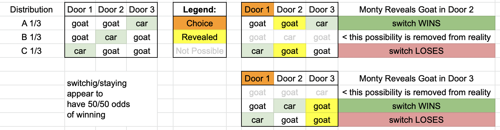

# Monty Hall Problem

[The Monty Hall Problem](https://en.wikipedia.org/wiki/Monty_Hall_problem) has plagued me for a decade. It's a problem I go back and read up on every few years and remember why it makes sense even though I can never manage to intuit why.

The short story is this: you have 3 doors. Two doors have a goat behind it, one has a car behind it. You get to choose a door. After you choose a door, the host of the game (Monty) reveals a goat behind one of the other two doors (he knows what's behind the doors and always only reveals a goat). You then have the option to change your mind and choose the remaining door. Counterintuitively, switching yields a 2/3 win where staying yields a 1/3 chance of getting the car.

In talking this over the last couple of days I found myself in a position of simultaneously believing that the probability math is correct and believing that there is something fundamentally wrong with how we model probability against reality--and specifically that this model of events and probabilities is correct:

## Reality Model 1 - Math Does Not Abide


In the above, there are 3 possible distributions. When Monty reveals a goat, it collapses reality into 1 of 4 possibilities, which simplify into 50/50 odds--this is a sort of quantum entanglement view of reality--but does reality at the macro level behave as it does in the quantum world? 
- If we see that a goat is behind `Door 2`, then `Distribution B` is no longer possible (`Door 2` cannot have been allocated a car in the initial random placement).
    - If you were in distribution A, switching wins
    - If you were in distribution C, switching loses
- If we see that a goat is behind `Door 3`, then `Distribution A` is no longer possible (`Door 3` cannot have been allocated a car in the initial random placement)
    - If you were in distribution B, switching wins
    - If you were in distribution C, switching loses
It seems we have a 50/50 chance of winning whether we choose to stay with `Door 1`, or choose to switch to the other door.

This mixed view of holding the above model in mind (and finding no flaw in the argument) while believing that `math` is smarter than I am resulted in a troubling certainty that something is either fundamentally wrong with the Universe or that my brain is broken--and that maybe this kind of puzzle is a key to understanding how our reality is not mapped the way we map the sciences.
> Moreover, I now understand religion in a way I didn't before.

I didn't want to take anyone's word for it, so I coded up a program to run the probability experiment (just to double check the math). Spoiler: `the math checks out`.

After writing this repo and hammering away at a spreadsheet of possibilities and pouring over [The Wikipedia Page](https://en.wikipedia.org/wiki/Monty_Hall_problem) to try to figure out why the above model of reality is faulty, I finally drew this view of reality, which rectifies the problem:

## Reality Model 2 - The Math Abides


In the above model, you can clearly see that there are 3 possible realities (just as there are in the first model). However, now perhaps it's clearer to see that switching wins 2/3 times. 

The trick here might be that in the earlier model, we are starting with the notion of Monty revealing a door and then evaluating which reality distribution we fell into. In this model, we accept that we have already landed in one of the stable realities and if we are in `distribution A`, Monty `cannot` reveal a goat behind `Door 3` -- his only option is to expose the goat in `Door 2`. However, if we are in `distribution C`, Monty could open either `Door 2` or `Door 3`. So side with the math, accept that you are locked into a stable reality, and act accordingly.

# The Code

This repo contains a simple bit of code to run the probability of winning with a switching vs staying strategy.

Here is an example output:

```
ran 1000000 iterations of each experiment
switching: 665765 wins, 334235 losses, (0.665765)
staying: 333466 wins, 666534 losses, (0.333466)
```

Run yourself by cloning this repo, navigating into the directory and running the following (assuming you have [Node.js](https://nodejs.org/en/) installed)

```
npm i
node .
```

# About

Adam is this guy who thinks he's real but he might not be: https://twitter.com/antic
https://adameivy.com